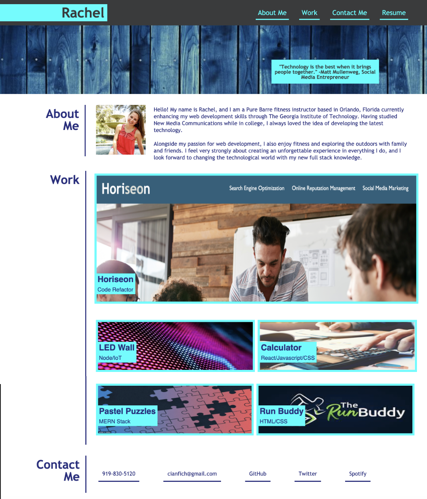

# Personal-Portfolio

This personal portfolio webpage is a site that gives information about myself and allows the user to view my personal projects. There is a "Description", "Work, and "Contact Me" section that can be navigated to from the header once the appropriate heading is clicked demonstrating with easy accessibility all an employer would be looking for when wanting to hire a new employee. 

## Features and Functionality

Below is a visualization of the webpage.

In the "Description" section a portrait and small personal summary exist. In the "Work" section, the first project image is larger than the rest of the images. The first links to the specific project website. The rest are placeholders to match the mock image until projects are completed. The "Contact Me" section has various contact options. Should a link be required, the corresponding text will open a new tab with the website once clicked. Webpage also has a responsive layout for screen size.

## Deployment Access

https://cianfich1016.github.io/Personal-Portfolio/

## License

Library can be found at:

https://github.com/cianfich1016/Personal-Portfolio

This project is licensed under the terms of the MIT license.